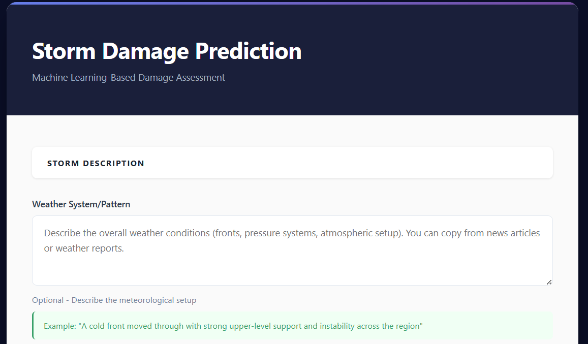
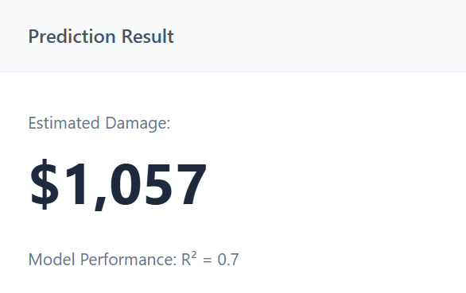
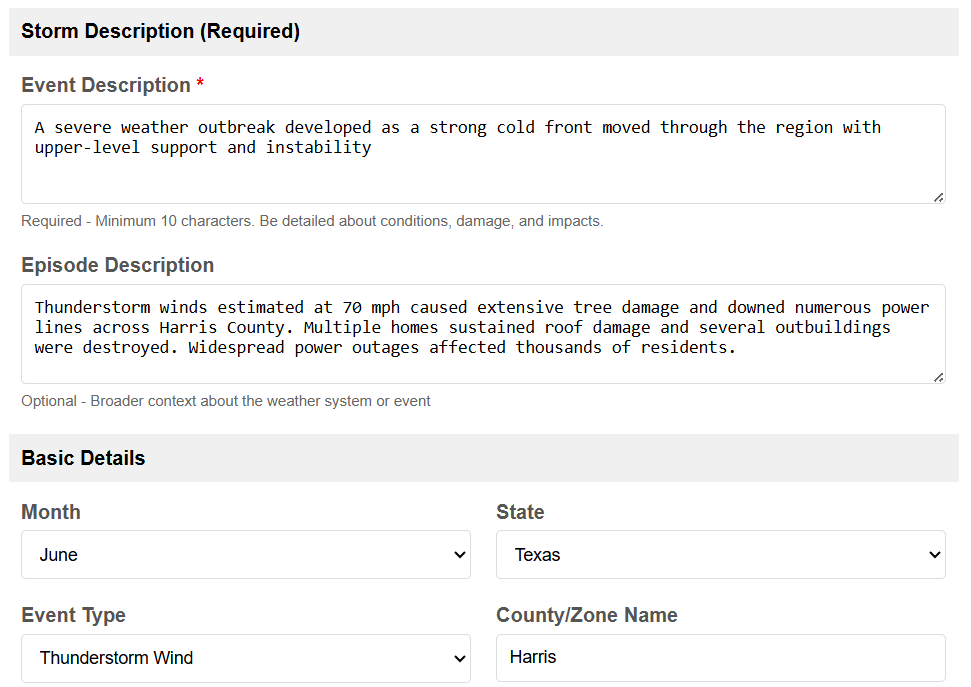

# Storm Damage Prediction

A machine learning model that estimates property damage from natural disasters. 

Using 20,000+ rows of NOAA storm data from 2025, we use various pre-processing and curation decisions to achieve ~70% R^2 accuracy in testing.

This model is continuously worked on to improve predictions. Expect updates here and R^2 improvements.

https://stormprediction.pages.dev

## Features
- Predicts property damage in USD based on storm details
- Utilizes XGBoost to achieve 70% R^2 accuracy
- Processes user descriptions using sentence embeddings
- Handles various storm types: Thunderstorms, Tornadoes, Floods, Hurricanes and 26 more!

## Details
- XGBoost Regressor
- R^2 Score: ~70%
- Data from NOAA Storm Events Database
- Range: $0-$50,000

